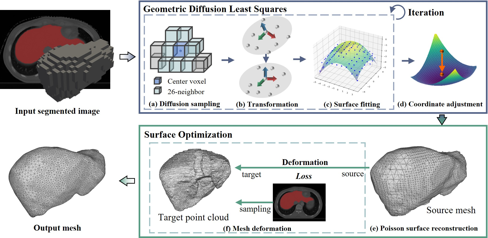

# GDLS-D: Two-Stage Medical Surface Reconstruction via Geometric Diffusion Least Squares and Iterative Deformation Optimization

<p align="center">
  
  <br/>
  <em>Figure: Overview of the GDLS-D.</em>
</p>

## Installation

We provide an `env.yaml` file that contains all required dependencies with pinned versions.

```bash
conda env create -f env.yaml
conda activate gdls
```

This will install Python 3.9, PyTorch 2.4.1, PyTorch3D 0.7.8, and all other necessary packages.

## Datasets
The datasets used in this paper are publicly available at the following links:

- **WORD Dataset** ([https://github.com/HiLab-git/WORD](https://github.com/HiLab-git/WORD)) — A large-scale CT dataset containing 150 scans with annotations for multiple abdominal organs.

- **CHAOS Dataset** ([https://chaos.grand-challenge.org](https://chaos.grand-challenge.org)) — A combined CT-MR healthy abdominal organ segmentation challenge dataset with 20 CT scans.

## Quick Start

To run the reconstruction pipeline, use the `main.py` script:

1. **Configure the pipeline** — Edit the following variables in `main.py`:

```python
cfg_path = 'config/liver.yaml'      # path to the configuration file for your target structure
data_path = 'data/CHAOS/1.nii.gz'   # path to your binary segmentation mask
save_path = 'results/output.ply'    # path for the output mesh
label_id = 1                        # label value of the target anatomy in the mask
```

2. Run the reconstruction:
```bash
python main.py
```

## Citation

If you find this work useful for your research, please cite our paper:

```bibtex
@article{shi2026gdls,
  title={GDLS-D: two-stage medical surface reconstruction via geometric diffusion least squares and iterative deformation optimization},
  author={Shi, Jing and He, Xianyue and Chen, Sichun and Xing, Yuan and Tang, Jisi and Wang, Fei and Ren, Xiangyun},
  journal={Medical \& Biological Engineering \& Computing},
  pages={1--17},
  year={2026},
  publisher={Springer}
}
```


